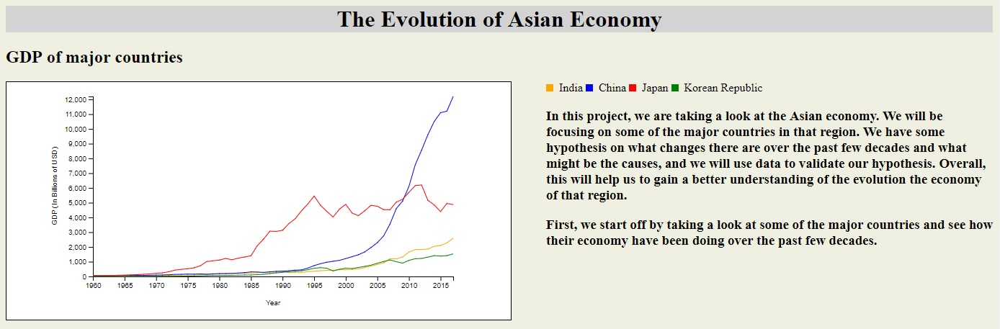

# The Evolution of Asian Economy
**Authors**: Haotian Shen (hs2685), Karan Bhatia (kb3053), Gaurav Wadhawan (gw979)

Group 18 

## About
In this project, we are taking a look at the Asian economy. We will be focusing on some of the major countries in that region. We have some hypothesis on what changes there are over the past few decades and what might be the causes, and we will use data to validate our hypothesis. Overall, this will help us to gain a better understanding of the evolution the economy of that region.

## More
[DEMO](https://nyu-vis-fall2018.github.io/group-18-The-Evolution-of-Asian-Economy/)

[Project Description](project.pdf)
